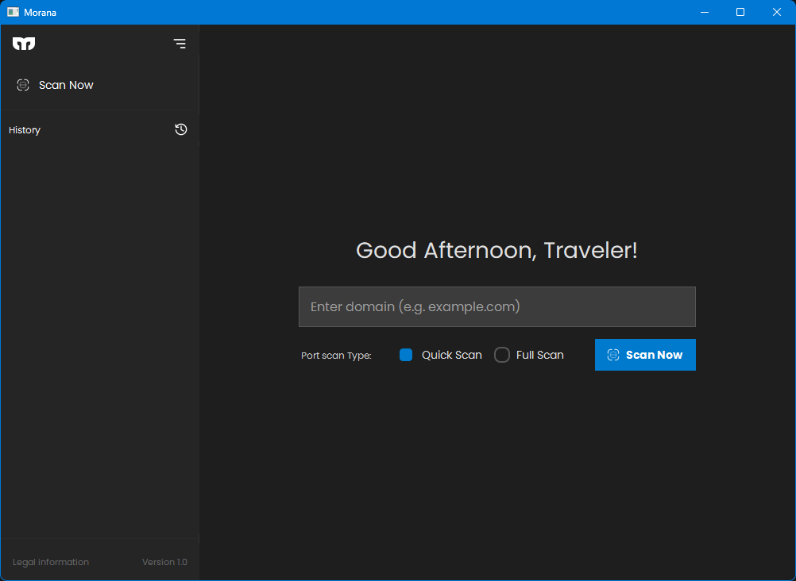

  

# Morana | Web Reconnaissance Console

## What is Morana ?

Morana is a **Web OSINT** tool that helps users collect publicly available information about a target domain, such as **abc.com**.

It is designed to support the reconnaissance phase of security assessments by helping researchers discover details about a target's online presence. Morana assists in gathering useful intelligence during the early stages of the Cyber Kill Chain and the cyber attack lifecycle, helping security professionals better understand potential attack surfaces.

Morana is built for **authorized** security testing, research, and educational purposes.

  

## Features

- DNS Lookup
- Port Scanner
- SSL Scanner
- WHOIS Scanner
- HTTP/HTTPS Header Scanner
- Sitemap Scanner
- Technology Scanner
- Report Generator

## Installation & Use

installation is very simple,
- Download the Morana
    - Check the **Releases**
    - Select **Morana Web Scanner v1.0.0**
    - Scroll to bottom
    - Download the **Morana-Web-Scanner-v1.0.0-Windows.zip**
    - Extract the **ZIP file**

- Run the **Morana.exe**

## Announcement
- The Linux version is currently under development and is progressing impressively. We look forward to sharing more updates as development continues. Thank you for your patience and support!

## Acknowledgements

Special thanks to the maintainers and contributors of the following open source projects:

- Requests
- Beautiful Soup 4
- DNS Python
- SSL
- Socket
- Datetime
- WHOIS

Your work made this project possible.

## Disclaimer

This tool is intended for **authorized security testing only**.

Users are responsible for ensuring they have permission to scan any target. The author is not responsible for misuse or illegal activities.

## License

This project is available under :

 -  [GNU GPL v3](LICENSE)

## Author

[Binara wijewickrama](https://github.com/binarays)

Copyright (C) 2026 Original 2026 Binara Wijewickrama
